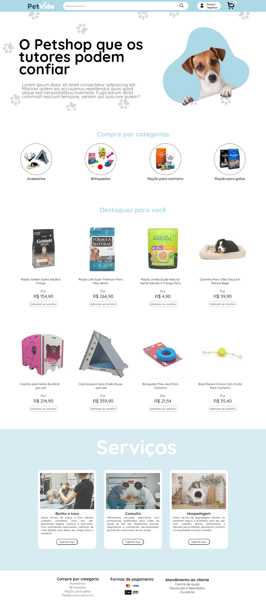

# petshop PetVida
Este projeto é um site de petshop que estou desenvolvendo desde o início dos meus estudos, há quase um ano, com o objetivo de aplicar e consolidar meus aprendizados em HTML, CSS e JavaScript. Totalmente idealizado e montado por mim, o site oferece diversas funcionalidades, como a compra de produtos (brinquedos, acessórios, ração para gatos e cachorros), além de permitir o agendamento de consultas veterinárias, serviços de banho e tosa, e até mesmo hospedagem de animais. Embora o projeto ainda esteja em desenvolvimento, ele já está em funcionamento e é constantemente aprimorado.

#### Link do site em funcionamento: <a href="https://petvida.netlify.app/"> Clique aqui </a>

## Próximas etapas de desenvolvimento do projeto
* Funcionalidade da barra de busca;
* Resposividade da página de detalhes do produto;
* Fazer algumas funcionalidades da página de detalhes do produto;
* Responsividade da página de banho e tosa;
* Responsividade do formulário banho e tosa;
* Responsividade da página de consultas;
* funcionalidades do formulário de consultas com javascript;
* Responsividade do formulário consultas;
* Fazer a página de hospedagem de pets;
* Responsividade do carrinho;
* Sistema de entrar e registrar com ultilização de bancos de dados e outras linguagens.

## Funcionalidades
* Compra de produtos para pets, como brinquedos, acessórios, ração para gatos e cachorros
* Agendamento de consultas veterinárias diretamente pelo site
* Agendamento de serviços de banho e tosa com opções de datas e horários
* Funcionalidade de hospedagem para animais, permitindo reservar períodos de estadia
* Interface de usuário totalmente responsiva, garantindo uma navegação fluida em diferentes dispositivos
* Carrinho de compras dinâmico com atualização de itens e cálculo em tempo real do total incluindo valor de frete.

## Tecnologias
- HTML
- CSS
- JavaScript

# Screenshot
Aqui temos a captura de tela do projeto:

 